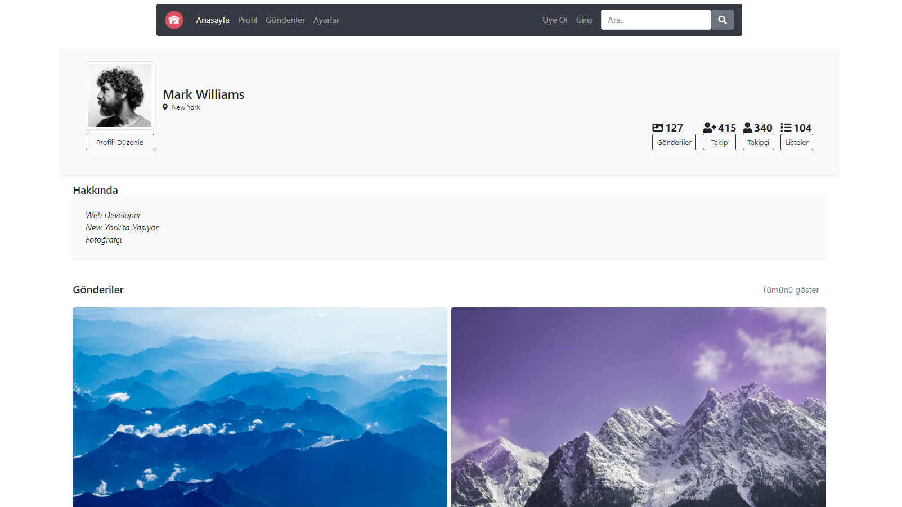

# Django-Frontend-Project

## Before running this project you need intall below list apps and packages

Install Python 3.9 or above -> https://www.python.org/ 
Install Pip   -> python get-pip.py 

pip install Django 
pip install virtualenvwrapper-win 
mkvirtualenv sanal_ortam 

## For running

workon sanal_ortam 
python manage.py runserver

# Home Pages
 
 
 
